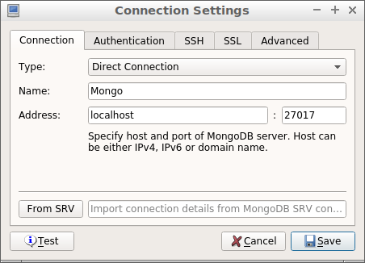
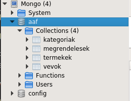

# MongoDB

## Célkitűzés

A gyakorlat célja, hogy a hallgatók megismerjék a _MongoDB_ általános célú dokumentumkezelő adatbázis alapvető működését, valamint a _MongoDB C#/.NET Driver_ használatát.

## Előfeltételek

A labor elvégzéséhez szükséges eszközök:

- Microsoft Visual Studio 2015/2017/2019 (_nem_ VS Code)
- MongoDB Community Edition
- Robo 3T
- Adatbázis létrehozó script: [mongo.js](https://raw.githubusercontent.com/bmeviauac01/gyakorlatok/master/mongo.js)
- Kiinduló alkalmazás kódja: <https://github.com/bmeviauac01/gyakorlat-mongo-kiindulas>

Amit érdemes átnézned:

- C# nyelv és Linq kifejezések
- MongoDB előadás
- [MongoDB használata segédlet](../Adatbazis/mongodb.md)

## Gyakorlat menete

A gyakorlat végig vezetett, a gyakorlatvezető utasításai szerint haladjunk. Egy-egy részfeladatot próbáljunk meg először önállóan megoldani, utána beszéljük meg a megoldást közösen.

Emlékeztetőként a megoldások is megtalálhatóak az útmutatóban is. Előbb azonban próbáljuk magunk megoldani a feladatot!

## Feladat 0: Adatbázis létrehozása, projekt megnyitása

1. Hozzunk létre egy mappát, ahol dolgozni fogunk, például `c:\work\NEPTUN`.

   > A továbbiakban kezeljük ezt "munkakönyvtárként", tehát minden új mappát ebben hozzunk létre.

1. Indítsuk el a MongoDB szervert és hozzuk létre az adatbázist.

   - Hozzunk létre egy mappát az adatbázisfájloknak, például `db` néven. (Ezt a mappát az előbb létrehozott munkakönyvtárban hozzuk létre.)
   - Nyissunk egy _command prompt_-ot és indítsuk el a MongoDB szervert: `mongod.exe --dbpath="c:\work\<NEPTUN>\db"`
     - _Command prompt_ például a start menüben megkereshető a "cmd" kulcsszóval.
     - A laborokban a MongoDB a `c:\tools\mongodb\bin` könyvtárban van. Navigáljunk el ide a `cd` utasítással.
     - Ezt a command promptot ne zárjuk be, mert ebben fut a szerver. Leállítani Ctrl+C billentyűkombinációval lehet.

1. Hozzuk létre az adatbázis.

   - Töltsük le az adatbázislétrehozó scriptet és mentsük el `mongo.js` néven a munkakönyvtárunkba.
   - Nyissunk egy **új** _command prompt_-ot és hozzuk létre az adatbázist: `mongo.exe localhost:27017/aaf c:\work\NEPTUN\mongo.js`
     - Ez az exe most nem mongo**d**, csak mongo. Ez egy kliensprogram, amivel a szerverhez csatlakozva parancsokat futtathatunk.
     - A laborokban ezt az exe-t is a `c:\tools\mongodb\bin` könyvtárban találjuk.
     - Ügyeljünk a connection stringre, amiben a szerver elérése után az adatbázis neve is benne van!

1. Ellenőrizzük, hogy létrejött az adatbázis Robo3T segítségével.

   - Indítsuk el a Robo3T programot (laborokban a `c:\tools\robo3t` könyvtárban) és csatlakozzunk a MongoDB szerverhez.

     

   - Ellenőrizzük, hogy létrejöttek a megfelelő _Collection_-ök.

     

1. Töltsük le a méréshez tartozó projekt vázat!

   - Nyissunk egy **új** _command prompt_-ot a munkakönyvtárunkba.
   - Adjuk ki a következő parancsot: `git clone --depth 1 https://github.com/bmeviauac01/gyakorlat-mongo-kiindulas.git`

1. Nyissuk meg a `Mongo` könyvtár alatti _sln_ fájlt Visual Studio-val.

1. Vizsgáljuk meg a projektet.

   - Ez egy .NET Core konzol alkalmazás. Felépítésében hasonlít az Entity Framework gyakorlaton látotthoz: az `Entities` mappában találhatók az entitás osztályok, a megoldást pedig a `Program.cs` fájlba írjuk.
   - Nézzük meg a `Program.cs` tartalmát. Itt már megtalálható a MongoDB kommunikációhoz szükséges inicializáció.
     - Az `IMongoClient` interfész tartalmazza az adatbázissal való kommunikációhoz szükséges metódusokat. Ezeket nem fogjuk közvetlenül használni.
     - Az `IMongoDatabase` interfész reprezentálja az `aaf` adatbázist a MongoDB-n belül.
     - A különböző `IMongoCollection<TEntity>` interfészek pedig a különböző kollekciókat reprezentálják. Ezeket használva tudunk lekérdezéseket és módosító utasításokat kiadni.
   - Az adatbázisunk entitásainak C# osztályra való leképezése az `Entities` mappában található. Különbség itt az Entity Frameworkhöz képest, hogy itt ezt nekünk kézzel kell elkészítenünk.
     - Az entitások egy részének a leképezése már megtalálható itt.
     - A labor során még visszatérünk ide, és fogunk magunk is készíteni entitás osztályt.

## Feladat 1: Lekérdezések

A leképzett adatmodellen fogalmazd meg az alábbi lekérdezéseket a _MongoDB C#/.NET Driver_ használatával. Írd ki konzolra az eredményeket.

1. Listázd azon termékek nevét és raktárkészletét, melyből több mint 30 darab van raktáron!

1. Írj olyan lekérdezést, mely kilistázza azon megrendeléseket, melyekhez legalább két megrendeléstétel tartozik!

1. Készíts olyan lekérdezést, mely kilistázza azokat a megrendeléseket, melyek összértéke több mint 30000 Ft! Az eredményhalmaz kiírásakor a vevő ID-t követően soronként szerepeljenek az egyes tételek (Termék ID, mennyiség, nettó ár).

1. Listázd ki a legdrágább termék adatait!

1. Írj olyan lekérdezést, mely kilistázza azon termékeket, melyből legalább kétszer rendeltek!

<details><summary markdown="span">Megoldás</summary>

1. Ehhez a feladathoz csupán a termék kolleckióban kell egy egyszerű lekérdezést kiadnunk. A szűrési feltételt kétféleképpen is megfogalmazhatjuk: lambda kifejezés segítségével, és kézzel összerakva is.

    ```csharp
    Console.WriteLine("***** Első feladat *****");
    
    //2.1
    Console.WriteLine("\t2.1 1. megoldás:");
    var qTermekRaktarkeszlet1 = termekCollection
        .Find(termek => termek.Raktarkeszlet > 30)
        .ToList();
    
    foreach (var t in qTermekRaktarkeszlet1)
        Console.WriteLine($"\t\tNév={t.Nev}\tRaktrákészlet={t.Raktarkeszlet}");
    
    
    //2.1 második megoldás
    Console.WriteLine("\t2.1 2. megoldás:");
    var qTermekRaktarkeszlet2 = termekCollection
        .Find(Builders<Termek>.Filter.Gt(termek => termek.Raktarkeszlet, 30))
        .ToList();
    
    foreach (var t in qTermekRaktarkeszlet2)
        Console.WriteLine($"\t\tNév={t.Nev}\tRaktrákészlet={t.Raktarkeszlet}");
    ```

1. Ez a feladat nagyon hasonló ez előzőhöz. Figyeljük meg, hogy az SQL-es adatbázis séma esetén ehhez már `JOIN`-t (`Navigation Property`) kellett alkalmazni. Ezzel szemben itt minden szükséges adat a megrendelés kollekcióban található.

    ```csharp
    //2.2
    Console.WriteLine("\t2.2 1. megoldás:");
    var qMegrendelesTetelek1 = megrendelesCollection
        .Find(megrendeles => megrendeles.MegrendelesTetelek.Length >= 2)
        .ToList();

    foreach (var m in qMegrendelesTetelek1)
        Console.WriteLine($"\t\tVevő={m.VevoID}\tMegrendelés={m.ID}\tTételek={m.MegrendelesTetelek.Length}");


    //2.2 második megoldás
    Console.WriteLine("\t2.2 2. megoldás:");
    var qMegrendelesTetelek2 = megrendelesCollection
        .Find(Builders<Megrendeles>.Filter.SizeGte(megrendeles => megrendeles.MegrendelesTetelek, 2))
        .ToList();

    foreach (var m in qMegrendelesTetelek2)
        Console.WriteLine($"\t\tVevő={m.VevoID}\tMegrendelés={m.ID}\tTételek={m.MegrendelesTetelek.Length}");
    ```

1. Ehhez a feladathoz már nem elegendő számunkra a sima lekérdezés kifejezőereje, így az aggregációs pipeline-t kell alkalmaznunk. Figyeljük meg azonban, hogy a séma felépítése miatt továbbra is minden szükséges adat rendelkezésre áll egyetlen kolleckióban.

    ```csharp
    //2.3
    Console.WriteLine("\t2.3:");
    var qMegrendelesOssz = megrendelesCollection
        .Aggregate()
        .Project(megrendeles => new
        {
            VevoID = megrendeles.VevoID,
            MegrendelesTetelek = megrendeles.MegrendelesTetelek,
            Osszeg = megrendeles.MegrendelesTetelek.Sum(mt => mt.Mennyiseg * mt.NettoAr)
        })
        .Match(megrendeles => megrendeles.Osszeg > 30000)
        .ToList();

    foreach (var m in qMegrendelesOssz)
    {
        Console.WriteLine($"\t\tVevő={m.VevoID}");
        foreach (var mt in m.MegrendelesTetelek)
            Console.WriteLine($"\t\t\tTermék={mt.TermekID}\tÁr={mt.NettoAr}\tDb={mt.Mennyiseg}");
    }
    ```

1. A legdrágább termékek lekérdezéséhez két lekérdezést kell kiadnunk: először lekérdezzük a legmagasabb nettóár értékét, utána pedig lekérdezzük azokat a termékeket, melyeknek a nettóára megegyezik ezzel az értékkel.

    ```csharp
    //2.4
    Console.WriteLine("\t2.4:");
    var maxNettoAr = termekCollection
        .Find(_ => true)
        .SortByDescending(termek => termek.NettoAr)
        .Limit(1)
        .Project(termek => termek.NettoAr)
        .Single();

    var qTermekMax = termekCollection
        .Find(termek => termek.NettoAr == maxNettoAr)
        .ToList();

    foreach (var t in qTermekMax)
        Console.WriteLine($"\t\tNév={t.Nev}\tÁrt={t.NettoAr}");
    ```

1. Ez a feladat azért nehéz a jelenlegi adatbázissémánk mellett, mert itt már nem igaz az, hogy egyetlen kollekcióban rendelkezésre áll minden adat. Szükségünk van ugyanis a termék kollekcióból a termék nevére és raktárkészletére, a megrendelések kollekcióból pedig a termékhez tartozó megrendelések számára.
   
    Ilyen helyzetben MongoDB esetén kénytelenek vagyunk kliensoldalon (értsd: C# kódból) joinolni. A megoldás itt tehát hogy lekérdezzük az összes megrendelést, majd pedig C#-ból, LINQ segítségével összegyűjtjük az adott termékhez tartozó megrendeléstételeket. Ezután lekérdezzük az adatbázisból a termékeket is, hogy azok adatai is rendelkezésünkre álljanak.

    ```csharp
    //2.5
    Console.WriteLine("\t2.5:");
    var qMegrendeles = megrendelesCollection
        .Find(_ => true)
        .ToList();

    var termekRendeles = qMegrendeles
        .SelectMany(megrendeles => megrendeles.MegrendelesTetelek) // Egyetlen listába gyűjti a megrendeléstételeket.
        .GroupBy(mt => mt.TermekID)
        .Where(termek => termek.Count() >= 2);

    var qTermek = termekCollection
        .Find(_ => true)
        .ToList();
    var termekLookup = qTermek.ToDictionary(termek => termek.ID);

    foreach (var t in termekRendeles)
    {
        var termek = termekLookup.GetValueOrDefault(t.Key);
        Console.WriteLine($"\t\tNév={termek?.Nev}\tRaktrákészlet={termek?.Raktarkeszlet}\tMegrendelések={t.Count()}");
    }
    ```

    > Úgy tudnánk hatékonyabbá tenni a lekérdezést, ha csak azokat a termékeket listázzuk, amelyek adataira ténylegesen szükségünk van. Hogyan tehetnénk ezt meg?

</details>

## Feladat 2: Entitásosztály létrehozása

1. Vizsgáld meg a `Termek` és az `AFA` entitásosztályokat. Miért van a `Termek` entitásban `[BsonId]` annotáció, és miért nincs az `AFA` osztályban?

1. Hozz létre entitásosztályt a `Kategoria` entitásnak, és vedd fel hozzá a megfelelő `IMongoCollection<Termek>` interfészt.

<details><summary markdown="span">Megoldás</summary>

1. A `Termek` osztály a `termekek` kollekciót reprezentálja az adatbázisban, ezért tartozik hozzá egyedi `ObjectID` ami alapján hivatkozni tudunk rá az adatbázis felé. Ezzel szemben az `AFA` osztály a `Termek` egy beágyazott objektuma, önmagában nem jelenik meg kollekcióként. Ezért nem tartozik hozzá `ObjectID` érték.

1. Hozzunk létre új POCO osztályt `Kategoria` néven.

    Nézzük meg először a Robo3T program segítségével, hogy milyen adattagok találhatók a `kategoriak` kollekcióban lévő dokumentumokban.

    

    Ez alapján létre tudjuk hozni a `Kategoria` osztályt.

    ```csharp
    public class Kategoria
    {
        [BsonId]
        public ObjectId ID { get; set; }
        public string Nev { get; set; }
        public ObjectId? SzuloKategoriaID { get; set; }
    }
    ```

    A `Program.cs` fájlban vegyül fel az új kollekció interfészt.

    ```csharp
    private static IMongoCollection<Kategoria> kategoriaCollection;
    ```

    Az `initialize` metódusban pedig inicializáljuk is ezt a kollekciót.

    ```csharp
    kategoriaCollection = database.GetCollection<Kategoria>("kategoriak");
    ```


</details>

## Feladat 3: Adatmódosítások

Az `IMongoColection<TEntity>` interfész nem csak lekérdezéshez használható, hanem rajta keresztül módosítások is végrehajthatóak.

1. Írj olyan _MongoDB C#/.NET Driverre_ épülő C# kódot, mely az "Építo elemek" (ügyelj az írásmódra!) árát megemeli 10 százalékkal!

1. Hozz létre egy új kategóriát a *Drága játékok*nak, és sorod át ide az összes olyan terméket, melynek ára, nagyobb, mint 8000 Ft!

1. Töröld ki az összes olyan kategóriát, amelyhez nem tartozik termék.

<details><summary markdown="span">Megoldás</summary>

1. Először lekérdezzük a megfelelő kategória ID-ját, majd az ehhez tartozó termékekre adunk ki módosító utasítást.

    ```csharp
    Console.WriteLine("***** Harmadik feladat *****");

    //3.1
    Console.WriteLine("\t3.1:");
    var qKategoriaEpitoID = kategoriaCollection
        .Find(kategoria => kategoria.Nev == "Építo elemek")
        .Project(kategoria => kategoria.ID)
        .Single();

    var qTermekEpito = termekCollection
        .Find(termek => termek.KategoriaID == qKategoriaEpitoID)
        .ToList();
    Console.WriteLine("\t\tMódosítás előtt:");
    foreach (var t in qTermekEpito)
        Console.WriteLine($"\t\t\tNév={t.Nev}\tRaktrákészlet={t.Raktarkeszlet}\tÁr={t.NettoAr}");

    termekCollection.UpdateMany(
        filter: termek => termek.KategoriaID == qKategoriaEpitoID,
        update: Builders<Termek>.Update.Mul(termek => termek.NettoAr, 1.1));

    qTermekEpito = termekCollection
        .Find(termek => termek.KategoriaID == qKategoriaEpitoID)
        .ToList();
    Console.WriteLine("\t\tMódosítás után:");
    foreach (var t in qTermekEpito)
        Console.WriteLine($"\t\t\tNév={t.Nev}\tRaktrákészlet={t.Raktarkeszlet}\tÁr={t.NettoAr}");
    ```

1. MongoDB segítségével tranzakció nélkül atomikusan el tudjuk végezni a következő feladatot: "Kérem a `Drága Játék` kategóriát. Amennyiben nem létezik, hozd létre." Ehhez a `FindOneAndUpdate` parancs használatára van szükségünk.

    ```csharp
    //3.2
    Console.WriteLine("\t3.2:");
    var dragaJatek = kategoriaCollection.FindOneAndUpdate<Kategoria>(
        filter: kategoria => kategoria.Nev == "Drága Játék",
        update: Builders<Kategoria>.Update.SetOnInsert(kategoria => kategoria.Nev, "Drága Játék"),
        options: new FindOneAndUpdateOptions<Kategoria, Kategoria> { IsUpsert = true, ReturnDocument = ReturnDocument.After });

    termekCollection.UpdateMany(
        filter: termek => termek.NettoAr > 8000,
        update: Builders<Termek>.Update.Set(termek => termek.KategoriaID, dragaJatek.ID));

    var qTermekDraga = termekCollection
        .Find(termek => termek.KategoriaID == dragaJatek.ID)
        .ToList();
    foreach (var t in qTermekDraga)
        Console.WriteLine($"\t\tNév={t.Nev}\tÁrt={t.NettoAr}");
    ```

1. Lekérdezzük azokat a kategóriákat amelyekhez tartozik termék, majd pedig töröljük azokat, amelyek nem tartoznak ezek közé.

    ```csharp
    //3.3
    Console.WriteLine("\t3.3:");
    Console.WriteLine($"\t\tMódosítás előtt {kategoriaCollection.CountDocuments(_ => true)} db kategória");

    var qTermekKategoria = new HashSet<ObjectId>(termekCollection
        .Find(_ => true)
        .Project(termek => termek.KategoriaID)
        .ToList());

    kategoriaCollection.DeleteMany(kategoria => !qTermekKategoria.Contains(kategoria.ID));

    Console.WriteLine($"\t\tMódosítás után {kategoriaCollection.CountDocuments(_ => true)} db kategória");
    ```

    > Vegyük észre, hogy ez az utasítás nem atomikus. Ha közben vettek fel új terméket, akkor lehet, hogy olyan kategóriát törlünk amihez azóta tartozik termék. Nem vettük figyelemve továbbá a kategóriák hierarchiáját sem.

</details>